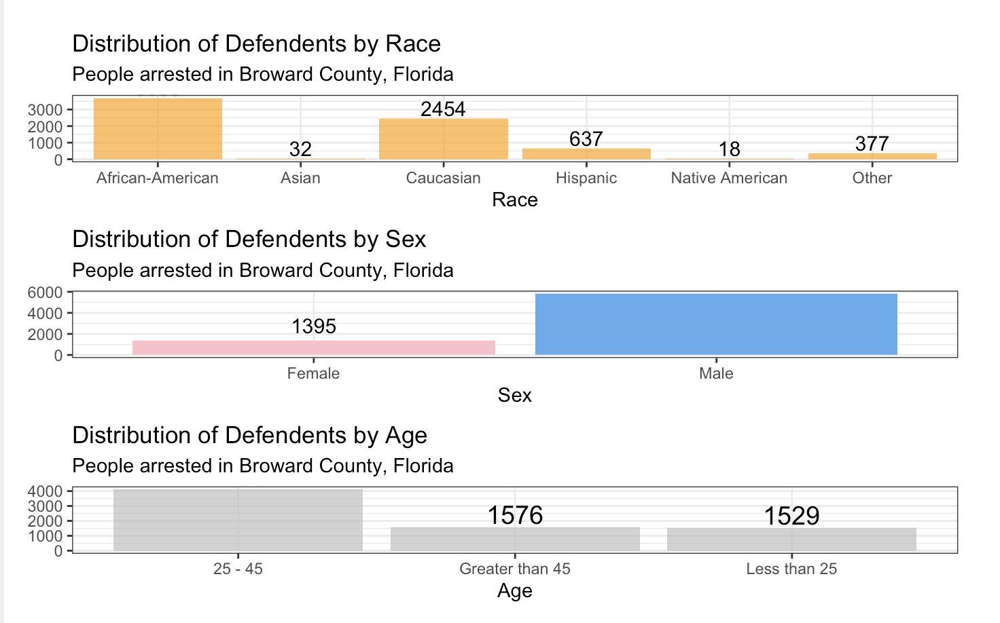

Lab 09B: Algorithmic Bias
================
Benjamin Egan
3/26/25

Here is the link to the assignment page:
<https://datascience4psych.github.io/DataScience4Psych/lab09.html>. This
includes the relevant information for the assignment alongside required
questions I needed to answer.

    ## Warning: package 'purrr' was built under R version 4.3.3

    ## Warning: package 'janitor' was built under R version 4.3.3

### The data

Cleaning up some of the names

``` r
compas <- read_csv("data/compas-scores-2-years.csv") %>% 
  clean_names() %>% 
  rename(decile_score = decile_score_12,
                         priors_count = priors_count_15)
```

    ## New names:
    ## Rows: 7214 Columns: 53
    ## ── Column specification
    ## ──────────────────────────────────────────────────────── Delimiter: "," chr
    ## (19): name, first, last, sex, age_cat, race, c_case_number, c_charge_de... dbl
    ## (19): id, age, juv_fel_count, decile_score...12, juv_misd_count, juv_ot... lgl
    ## (1): violent_recid dttm (2): c_jail_in, c_jail_out date (12):
    ## compas_screening_date, dob, c_offense_date, c_arrest_date, r_offe...
    ## ℹ Use `spec()` to retrieve the full column specification for this data. ℹ
    ## Specify the column types or set `show_col_types = FALSE` to quiet this message.
    ## • `decile_score` -> `decile_score...12`
    ## • `priors_count` -> `priors_count...15`
    ## • `decile_score` -> `decile_score...40`
    ## • `priors_count` -> `priors_count...49`

``` r
view(compas)

nrow(compas)
```

    ## [1] 7214

``` r
ncol(compas)
```

    ## [1] 53

## Part 1 - Exploring the Data

Almost there! Keep building on your work and follow the same structure
for any remaining exercises. Each exercise builds on the last, so take
your time and make sure your code is working as expected.

1.  Each row of the dataset represents an individual who arrested in
    Broward County, Florida. There are 7,214 people in the dataset, and
    53 different variables

2.  There should be 7,214 unique people in the dataset. After a quick
    glance through the dataset using view(), I haven’t seen a repeated
    ID number or person’s name.

### Visualizing demographic data

#### The distribution of defendants by race

``` r
Race_graph <- compas %>%
  ggplot(aes(
    x = race
  ))+
  geom_histogram(stat = "count", fill = "orange", alpha = .7)+
  theme_bw()+
  geom_text(
    stat = "count",
    aes(x = race,
    y = ..count..,
    label = ..count..),
    size = 4, 
    color = "black",
    vjust = -0.2) +
  labs(
    x = "Race",
    y = NULL,
    title = "Distribution of Defendents by Race",
    subtitle = "People arrested in Broward County, Florida"
  )

Race_graph
```

<!-- -->

#### The distribution of defendants by sex

``` r
Sex_graph <- compas %>%
  ggplot(aes(
    x = sex
  ))+
  geom_histogram(stat = "count", fill = c("pink", "steelblue2"))+
  theme_bw()+
  geom_text(
    stat = "count",
    aes(x = sex,
    y = (..count../2),
    label = ..count..),
    size = 7, 
    color = "black") +
  labs(
    x = "Sex",
    y = NULL,
    title = "Distribution of Defendents by Sex",
    subtitle = "People arrested in Broward County, Florida"
  )

Sex_graph
```

<!-- -->

#### The distribution of defendants by age

``` r
Age_graph <- compas %>%
  ggplot(aes(
    x = age_cat
  ))+
  geom_histogram(stat = "count", fill = "gray", alpha = .7)+
  theme_bw()+
  geom_text(
    stat = "count",
    aes(x = age_cat,
    y = ..count..,
    label = ..count..),
    size = 5, 
    color = "black",
    vjust = -0.2) +
  labs(
    x = "Age",
    y = NULL,
    title = "Distribution of Defendents by Age",
    subtitle = "People arrested in Broward County, Florida"
  )

Age_graph
```

<!-- -->

#### Optional - Graph all on the same page

Here I’m using plot_grid() from the cowplot package as one example of
how to do this. There are clear issues (such as size of text), but it
will get the job done.

``` r
library(cowplot)
```

    ## 
    ## Attaching package: 'cowplot'

    ## The following object is masked from 'package:lubridate':
    ## 
    ##     stamp

``` r
plot_grid(Race_graph,Sex_graph, Age_graph)
```

<!-- -->

I turned to chatGPT to see if it had any suggestions on fixing this
issue. It initially recommended adding the arguments ncol = 1, align =
“v” to the plot_grid(). This ended up creating this… unique outcome.

<figure>

<figcaption aria-hidden="true">This reminds me of Stretch
Armstrong</figcaption>
</figure>

I told it I wanted the Axes to be fixed, and it gave me a great
suggestion.

I can take the original dataset and create a subset of the data that
just includes race, sex, and age. From there, I can use the wide-to-long
transformation, making three separate rows for each person (one for
race, one for sex, one for age). Category is the designation of the IV,
and Value is what they identify as.

``` r
compas_long <- compas %>%
  pivot_longer(cols = c(race, sex, age_cat), names_to = "Category", values_to = "Value")
#view(compas_long)
```

Now, I can use facet_wrap() using category. This way, I can create three
separate graphs side by side. I copied its suggestion and then made
edits. These were for style and for aesthetic.

``` r
compas_long %>%
ggplot(aes(
  x = Value)) +
  geom_bar(aes(fill = Category), alpha = 0.7) +
  geom_text(
    stat = "count",
    aes(y = ..count.., 
        label = ..count..),
    vjust = -0.2,
    size = 3
  ) +
  theme_bw() +
  facet_wrap(~Category, labeller = as_labeller(c(`age_cat` = "Age", `race` = "Race", `sex` = "Sex")), scales = "free_x")+ # scales = "free_x" keeps different x-scales while aligning axes properly
  labs(
    x = NULL,
    y = "Count",
    title = "Distribution of Defendants",
    subtitle = "People arrested in Broward County, Florida"
  ) +
  theme(legend.position = "none",
        axis.text.x = element_text(angle = -45, vjust = 0.5, hjust=.5)
        )
```

<!-- -->

The downside is that I can’t change the colors of each of the graphs to
what I had them.

#### Visualization of the COMPAS risk scores

``` r
compas %>%
  ggplot(aes(
    x = decile_score
  ))+
  theme_bw()+
  geom_histogram(stat = "count", fill = "gray")+
    geom_text(
    stat = "count",
    aes(x = decile_score,
    y = ..count..,
    label = ..count..),
    size = 3.5, 
    color = "black",
    vjust = -0.2) +
  labs(
    x = "COMPAS risk scores",
    y = NULL,
    title = "Distribution of Defendents by COMPAS risk",
    subtitle = "People arrested in Broward County, Florida"
  )
```

<!-- -->

## Part 2 - Risk scores and recidivism

``` r
compas %>%
  ggplot(aes(
    x = two_year_recid,
    y = decile_score
  ))+
  geom_smooth(formula = y~x, se = FALSE, color = "black")+
   labs(
    x = "Whether the defendant recidivated within two years (0 = no, 1 = yes)",
    y = "COMPAS risk score",
    title = "The relationship between risk scores and actual recidivism"
  )
```

    ## `geom_smooth()` using method = 'gam'

<!-- -->

``` r
compas %>%
  ggplot(aes(
    x = two_year_recid,
    y = decile_score
  ))+
  geom_jitter()+
 # geom_smooth(formula = y~x, se = FALSE, color = "black")+
   labs(
    x = "Whether the defendant recidivated within two years (0 = no, 1 = yes)",
    y = "COMPAS risk score",
    title = "The relationship between risk scores and actual recidivism"
  )
```

<!-- -->

Assuming I did this correctly, it appears that recidivism, on average,
increases COMPAS risk score.

#### Alternate plot

``` r
compas %>%
  ggplot(aes(
    x = decile_score
  ))+
  geom_histogram()+
      geom_text(
    stat = "count",
    aes(x = decile_score,
    y = ..count..,
    label = ..count..),
    size = 3.5, 
    color = "black",
    vjust = -0.2) +
  facet_wrap(~ two_year_recid, labeller = as_labeller(c(`0` = "Recidivated within two years", `1` = "Did not recidivate within two years")))+
  labs(
    x = "COMPAS risk score from 1-10 (higher = greater risk)",
    y = NULL,
    title = "The relationship between risk scores and actual recidivism"
  )
```

    ## `stat_bin()` using `bins = 30`. Pick better value with `binwidth`.

<!-- -->

This plot is more showing the breakdown of COMPAS scores based on
recidivism.

### COMPAS Accuracy

``` r
compas_accuracy <- compas %>%
  mutate(compas_accurate = case_when(
    decile_score >= 7 & two_year_recid == 1 ~ "Accurate, committed crime",
    decile_score < 7 & two_year_recid == 1 ~ "Not acccurate, committed crime",
    decile_score <= 4 & two_year_recid == 0 ~ "Accurate, no further crime",
    decile_score > 4 & two_year_recid == 0 ~ "Not accurate, no further crime"
  ))

percent_accurate <- compas %>%
  mutate(compas_accurate = case_when(
    decile_score >= 7 & two_year_recid == 1 ~ 1,
    decile_score < 7 & two_year_recid == 1 ~ 0,
    decile_score <= 4 & two_year_recid == 0 ~ 1,
    decile_score > 4 & two_year_recid == 0 ~ 0
  ))

compas_accuracy %>%
  ggplot(aes(
    x = compas_accurate,
    fill = compas_accurate
  ))+
  geom_histogram(stat="count")+
  scale_fill_manual(values=c("green4", "green4","red2", "red2"))+
  coord_flip()+
  labs(
    x = "Accuracy of COMPAS",
    y = NULL,
    title = "How accurate is the COMPAS based on recidivism"
  )+
  theme(legend.position = "none")
```

<!-- -->

It’s hard to tell. Yes there are lots of people who it accurately
predicts, but that could be based on how people score on the
COMPAS/their recidivism.

``` r
committed_crime_test <- compas %>%
  mutate(compas_accurate = case_when(
    decile_score >= 7 & two_year_recid == 1 ~ "Accurate, committed crime",
    decile_score < 7 & two_year_recid == 1 ~ "Not acccurate, committed crime",
    decile_score <= 4 & two_year_recid == 0 ~ "Accurate, no further crime",
    decile_score > 4 & two_year_recid == 0 ~ "Not accurate, no further crime"
  ))

df_percent1 <- count(percent_accurate, compas_accurate)

Rec_total_accurate <- df_percent1 %>%
  filter(compas_accurate == 0) %>% select(n)

Rec_total_innacute <- df_percent1 %>%
  filter(compas_accurate == 1) %>% select(n)

Rec_total <- df_percent1 %>% summarize(sum = sum(n))

Rec_total_accurate/Rec_total*100
```

    ##          n
    ## 1 44.10868

``` r
committed_crime <- compas %>%
  mutate(compas_accurate = case_when(
    decile_score >= 7 & two_year_recid == 1 ~ 1,
    decile_score < 7 & two_year_recid == 1 ~ 2,
    decile_score <= 4 & two_year_recid == 0 ~ 3,
    decile_score > 4 & two_year_recid == 0 ~ 4
  ))


df_percent2 <- count(committed_crime, compas_accurate)

acc_commit <- df_percent2 %>%
  filter(compas_accurate == 1) %>% select(n)

not_acc_commit <- df_percent2 %>%
  filter(compas_accurate == 2) %>% select(n)

acc_no_commit <- df_percent2 %>%
  filter(compas_accurate == 3) %>% select(n)

not_acc_no_commit <- df_percent2 %>%
  filter(compas_accurate == 4) %>% select(n)

total_breakdown <- df_percent2 %>% summarize(sum = sum(n))

acc_commit/total_breakdown*100
```

    ##          n
    ## 1 18.72747

``` r
acc_commit/(acc_commit + not_acc_commit)*100
```

    ##          n
    ## 1 41.55644

``` r
acc_no_commit/(acc_no_commit+not_acc_no_commit)*100
```

    ##          n
    ## 1 67.65077

7.  The COMPAS algorithm doesn’t perform great (44% overall accuracy,
    41% accurate among people who commit a crime). It’s mostly accurate
    for predicting people who won’t commit another crime (67%).

## Part 3 - Investigating Disparities

``` r
race_graph <- compas %>%
filter(race == c("Caucasian","African-American"))


race_graph %>%
  ggplot(aes(
    x = decile_score
  ))+
  facet_wrap(~ race, labeller = as_labeller(c(`Caucasian` = "White", `African-American` = "Black")))+
  geom_histogram(stat = "count")+
  labs(
    x = "COMPAS risk score from 1-10 (higher = greater risk)",
    y = NULL,
    title = "Race disparities on the COMPAS scores"
  )
```

    ## Warning in geom_histogram(stat = "count"): Ignoring unknown parameters:
    ## `binwidth`, `bins`, and `pad`

<!-- -->

``` r
race_accurate <- race_graph %>%
  mutate(race_compas_accurate = case_when(
    decile_score >= 7 & race == "Caucasian" ~ 1,
    decile_score >= 7 & race == "African-American" ~ 0
  ))


race_percent <- count(race_accurate, race_compas_accurate)


White_accurate <- race_percent %>%
  filter(race_compas_accurate == 1) %>% select(n)

Black_accurate <- race_percent %>%
  filter(race_compas_accurate == 0) %>% select(n)

Black_accurate/(White_accurate + Black_accurate )*100
```

    ##          n
    ## 1 78.26087

There’s a clear difference in distribution between white and black
defendants who were classified as high risk, as 78% of people who had a
COMPAS score above 7 were black.

### Q10 - Accuracy of predictions for different racial groups

#### False Positive

I’ll admit I tried this 30 different ways. I turned to ChatGPT to ask
for help. We went back and forth on code that didn’t initially work, and
I teased out what parts weren’t working and what I truly needed. We
settled on this code.

``` r
non_recidivists <- race_graph %>%
  filter(two_year_recid == 0)


total_non_recid <- non_recidivists %>%
  group_by(race) %>%
  summarise(total_non_recid = n())


false_positives <- non_recidivists %>%
  filter(decile_score >= 7) %>%
  group_by(race) %>%
  summarise(false_positives = n())


fpr_results <- left_join(false_positives, total_non_recid, by = "race") %>%
  mutate(FPR = false_positives / total_non_recid * 100)

fpr_results
```

    ## # A tibble: 2 × 4
    ##   race             false_positives total_non_recid   FPR
    ##   <chr>                      <int>           <int> <dbl>
    ## 1 African-American             198             879 22.5 
    ## 2 Caucasian                     62             748  8.29

#### False Negative

I edited the code from above.

``` r
recidivists <- race_graph %>%
  filter(two_year_recid == 1)


total_recid <- recidivists %>%
  group_by(race) %>%
  summarise(total_recid = n())


false_negatives <- recidivists %>%
  filter(decile_score <= 4) %>%
  group_by(race) %>%
  summarise(false_negatives = n())


fnr_results <- left_join(false_negatives, total_recid, by = "race") %>%
  mutate(FNR = false_negatives / total_recid * 100)

fnr_results
```

    ## # A tibble: 2 × 4
    ##   race             false_negatives total_recid   FNR
    ##   <chr>                      <int>       <int> <dbl>
    ## 1 African-American             279         979  28.5
    ## 2 Caucasian                    238         490  48.6

#### Visualizing False positives and negatives

``` r
error_rates1 <- merge(fnr_results,fpr_results, by="race")

error_rate_adjusted <- error_rates1 %>%
  pivot_longer(cols = -c(race, total_recid,), names_to = "Error_type")

error_rate_adjusted %>%
  ggplot(aes(
    x = race, 
    y = value, 
    group = Error_type,
    color = Error_type
  )) +
  geom_line(size = 1) +
  geom_point(size = 3) +
  facet_wrap(~Error_type, scales = "free", 
      labeller = as_labeller(c(
         `false_negatives` = "False Negatives", 
         `false_positives` = "False Positives", 
         `FNR` = "False Negative Proportion",
         `FPR` = "False Positive Proportion", 
         `total_non_recid` = "Non-recidivism"
             ))) +
  scale_color_manual(values = c(
    "false_negatives" = "red",
    "false_positives" = "blue",
    "FNR" = "darkgreen",
    "FPR" = "purple",
    "total_non_recid" = "orange"
  )) +
  theme_bw()+
  theme(axis.text.x = element_text(angle = -10, vjust = 0.5, hjust=.5))+
  labs(
    x = "Race",
    y = NULL,
    title = "Accuracy of predictions for different racial groups",
    color = "Prediction Results"
  )
```

    ## Warning: Using `size` aesthetic for lines was deprecated in ggplot2 3.4.0.
    ## ℹ Please use `linewidth` instead.
    ## This warning is displayed once every 8 hours.
    ## Call `lifecycle::last_lifecycle_warnings()` to see where this warning was
    ## generated.

<!-- -->

Based on the above, we can see that Black defendants have higher false
positives. This means black defendants are more likely to be
non-recidivists who were classified as high risk. Although there were
more false negatives (recidivists who were classified as low risk), this
can be explained by the false negative proportion. There were twice as
many black defendants classified as recidivists than white defendants.

## Part 4 - Understanding the source bias

``` r
compas %>%
  ggplot(aes(
    x = decile_score,
    y = priors_count
  ))+
  geom_jitter(width = .5, alpha = .6)+
  facet_wrap(~race)
```

<!-- -->
